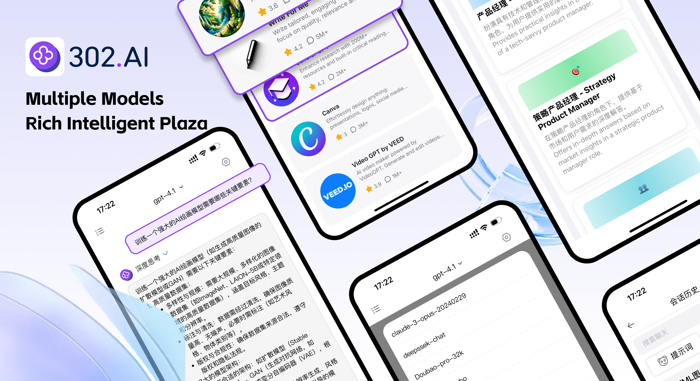

<h1 align="center">

<span>
    302.AI App
</span>
</h1>
 
<p align="center">
<em>302.AI is a powerful AI intelligent chat application that opens up a new conversational experience for you. We have brought together mainstream top AI models including Deepseek, Qwen, Kimi K2 and more, allowing you to enjoy cutting-edge AI technology in one place.</em>
</p>

<p align="center"><a href="https://apps.apple.com/us/app/302-ai/id6744959746" target="blank"></a></p >

<p align="center"><a href="README_zh.md">中文</a> | <a href="README.md">English</a> | <a href="README_ja.md">日本語</a></p>



## 🌟 Key Features

### 💬 AI Chat Features
- 🤖 Multiple models integration, no more frequent app switching (supports Deepseek, Qwen, Kimi K2, Doubao and many other AI models)
- 🔄 Streaming conversations, real-time responses
- 📚 Context memory, intelligent dialogue
- 🎯 Custom system prompts

### 🖼️ Image Processing Features
- 📸 Image upload and AI analysis
- 🔍 Intelligent image content recognition
- 📱 Support for multiple image formats

### 🎙️ Voice Features
- 🎤 Voice input recognition
- 🗣️ Real-time speech-to-text
- 🎵 Audio file support

### 🛠️ Advanced Features
- 🌐 Internet search capability
- 🔍 Deep search mode
- 🧠 Reasoning mode (R1 Fusion)
- ⚡ Real-time preview
- 📝 Markdown rendering

### 🎨 User Experience
- 🌙 Dark/Light theme switching
- 👤 Custom user avatars


## 🚀 Quick Start

### ⚡ Installation and Usage

#### Method 1: Via App Store (Recommended)

[Click to Install](https://apps.apple.com/us/app/302-ai/id6744959746)

#### Method 2: Developer Installation
```bash
# 1️⃣ Clone project
git clone https://github.com/302ai/302.AI-iOS-APP.git
cd 302.AI-iOS-APP

# 2️⃣ Open the project using Xcode
open Chat302AI.xcodeproj

# 3️⃣ Configure development team and bundle ID

# 4️⃣ Run Project 🎉
# Select the target device in Xcode and run it
```

### 🔑 API Configuration

1. Get 302.AI API key: Visit [302.AI](https://302.ai) to register an account
2. Add API key in the app:
   - Open app settings
   - Enter your API key  
   - Select preferred AI service provider

## 📱 Feature Details

### 🗨️ Chat Features

- **Multiple Model Support**: GPT-4o, GPT-4o mini, DeepSeek, etc.
- **Streaming Response**: Real-time AI reply display
- **Context Management**: Smart conversation history memory
- **Custom Prompts**: Personalized system prompts

### 🖼️ Image Features

- **Image Analysis**: Upload images for AI analysis
- **Multi-format Support**: PNG, JPEG, WebP, etc.

### 🎙️ Voice Interaction

- **Voice Input**: Long press to record, auto text conversion
- **Voice Playback**: AI response voice reading
- **Multi-language Support**: Chinese and English voice recognition

### ⚙️ Advanced Settings

- **Internet Search**: Get real-time information
- **Deep Search**: More comprehensive information retrieval
- **Reasoning Mode**: R1 chain-of-thought reasoning

## 💬 Contact Us

<div align="center">

[](https://302.ai)
[](https://github.com/302ai/302.AI-iOS-APP)
[](mailto:support@302.ai)

**Having issues?** Please report them in [GitHub Issues](https://github.com/302ai/302.AI-iOS-APP/issues)

</div>

## 📄 License

This project is licensed under the [MIT](LICENSE) License, which means you can freely use, modify and distribute it.

## ✨ About 302.AI ✨
[302.AI](https://302.ai) is a pay-as-you-go AI application platform, bridging the gap between AI capabilities and practical implementation.
1. 🧠 Comprehensive AI capabilities: Incorporates the latest in language, image, audio, and video models from leading AI brands.
2. 🚀 Advanced application development: We build genuine AI products, not just simple chatbots.
3. 💰 No monthly fees: All features are pay-per-use, fully accessible, ensuring low entry barriers with high potential.
4. 🛠 Powerful admin dashboard: Designed for teams and SMEs - managed by one, used by many.
5. 🔗 API access for all AI features: All tools are open-source and customizable (in progress).
6. 💡 Powerful development team: Launching 2-3 new applications weekly with daily product updates. Interested developers are welcome to contact us.
