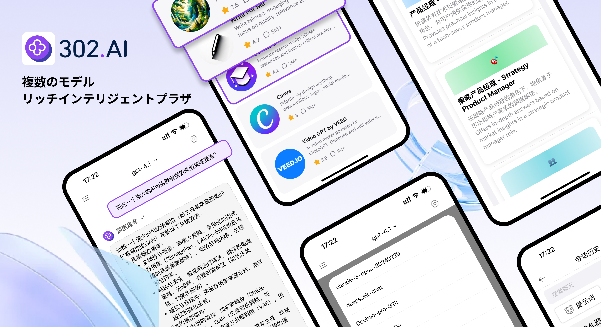

<h1 align="center">

<span>
    302.AI App
</span>
</h1>
 
<p align="center">
<em>302.AIは、強力なAIインテリジェントチャットアプリケーションで、新しい対話体験を提供します。DeepSeek、Qwen、Kimi K2などの主要なAIモデルを集約し、最先端のAI技術をワンストップで楽しむことができます。</em>
</p>

<p align="center"><a href="https://apps.apple.com/us/app/302-ai/id6744959746" target="blank"></a></p >

<p align="center"><a href="README_zh.md">中文</a> | <a href="README.md">English</a> | <a href="README_ja.md">日本語</a></p>



## 🌟 主な特徴

### 💬 AIチャット機能
- 🤖 複数のモデルを統合、アプリの頻繁な切り替えが不要（Deepseek、Qwen、Kimi K2、Doubaoなど多数のAIモデルをサポート）
- 🔄 ストリーミング対話、リアルタイムレスポンス
- 📚 文脈記憶、インテリジェントな対話
- 🎯 カスタムシステムプロンプト

### 🖼️ 画像処理機能
- 📸 画像アップロードとAI分析
- 🔍 インテリジェントな画像コンテンツ認識
- 📱 複数の画像フォーマットをサポート

### 🎙️ 音声機能
- 🎤 音声入力認識
- 🗣️ リアルタイム音声テキスト変換
- 🎵 音声ファイルサポート

### 🛠️ 高度な機能
- 🌐 インターネット検索機能
- 🔍 ディープサーチモード
- 🧠 推論モード（R1 Fusion）
- ⚡ リアルタイムプレビュー機能
- 📝 Markdownレンダリング

### 🎨 ユーザーエクスペリエンス
- 🌙 ダーク/ライトテーマ切り替え
- 👤 カスタムユーザーアバター


## 🚀 クイックスタート

### ⚡ インストールと使用方法

#### 方法1：App Store経由（推奨）

[インストールする](https://apps.apple.com/us/app/302-ai/id6744959746)

#### 方法2：開発者のインストール
```bash
# 1️⃣ プロジェクトのクローン
git clone https://github.com/302ai/302.AI-iOS-APP.git
cd 302.AI-iOS-APP

# 2️⃣ Xcodeを使用してプロジェクトを開く
open Chat302AI.xcodeproj

# 3️⃣ 開発チームとBundle IDの構成

# 4️⃣ プロジェクトの実行 🎉
# Xcodeでターゲットデバイスを選択して実行
```

### 🔑 API設定

1. 302.AI APIキーの取得：[302.AI](https://302.ai)にアクセスしてアカウントを登録
2. アプリでAPIキーを追加：
   - アプリ設定を開く
   - APIキーを入力
   - 好みのAIサービスプロバイダーを選択

## 📱 機能の詳細

### 🗨️ チャット機能

- **マルチモデル対応**: GPT-4o、GPT-4o mini、DeepSeekなど
- **ストリーミングレスポンス**: AIの応答をリアルタイムで表示
- **コンテキスト管理**: 会話履歴のスマートな記憶
- **カスタムプロンプト**: パーソナライズされたシステムプロンプト

### 🖼️ 画像機能

- **画像分析**: 画像をアップロードしてAI分析
- **マルチフォーマット対応**: PNG、JPEG、WebPなど

### 🎙️ 音声インタラクション

- **音声入力**: 長押しで録音、自動テキスト変換
- **音声再生**: AI応答の音声読み上げ
- **多言語対応**: 中国語と英語の音声認識

### ⚙️ 詳細設定

- **インターネット検索**: リアルタイム情報の取得
- **ディープサーチ**: より包括的な情報検索
- **推論モード**: R1思考チェーン推論

## 💬 お問い合わせ

<div align="center">

[](https://302.ai)
[](https://github.com/302ai/302.AI-iOS-APP)
[](mailto:support@302.ai)

**問題がありますか？** [GitHub Issues](https://github.com/302ai/302.AI-iOS-APP/issues) で報告してください

</div>

## 📄 ライセンス

このプロジェクトは [MIT](LICENSE) ライセンスの下で公開されており、自由に使用、修正、配布することができます。

## ✨ 302.AIについて ✨
[302.AI](https://302.ai)は、AIの能力と実用的な実装の間のギャップを埋める、従量制のAIアプリケーションプラットフォームです。
1. 🧠 包括的なAI機能：主要AIブランドの最新の言語、画像、音声、ビデオモデルを統合。
2. 🚀 高度なアプリケーション開発：単なるシンプルなチャットボットではなく、本格的なAI製品を構築。
3. 💰 月額料金なし：すべての機能が従量制で、完全にアクセス可能。低い参入障壁と高い可能性を確保。
4. 🛠 強力な管理ダッシュボード：チームやSME向けに設計 - 一人で管理し、多くの人が使用可能。
5. 🔗 すべてのAI機能へのAPIアクセス：すべてのツールはオープンソースでカスタマイズ可能（進行中）。
6. 💪 強力な開発チーム：大規模で高度なスキルを持つ開発者集団。毎週2-3の新しいアプリケーションをリリースし、毎日製品更新を行っています。才能ある開発者の参加を歓迎します。
